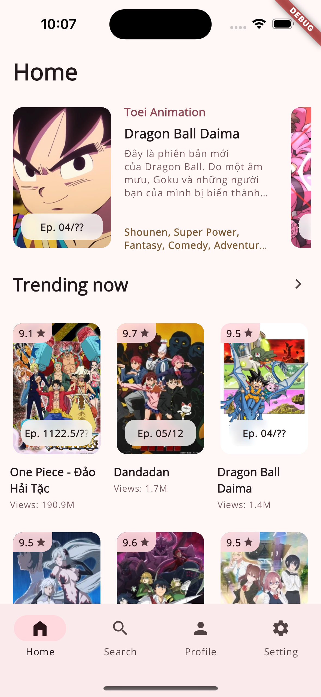
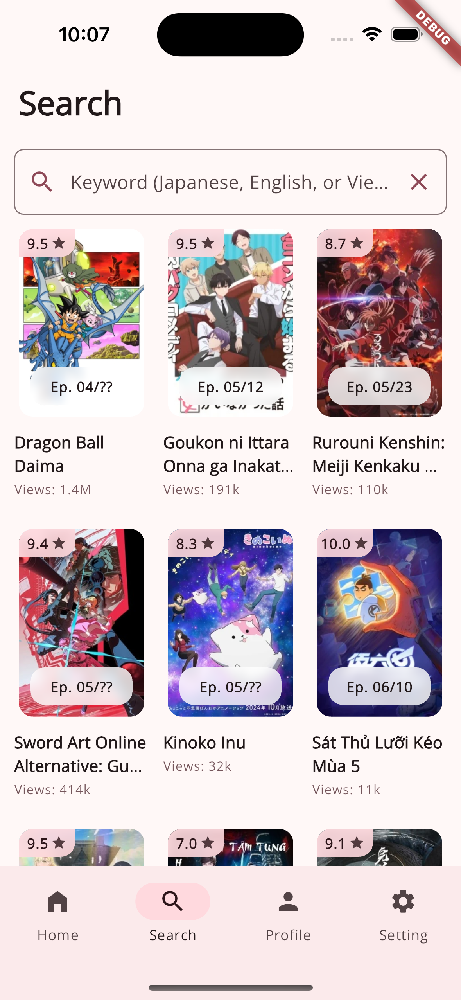
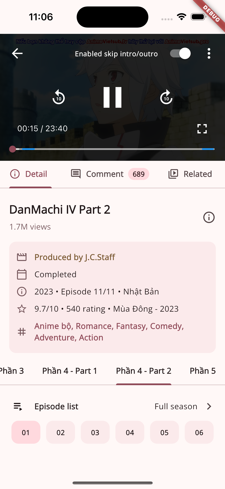
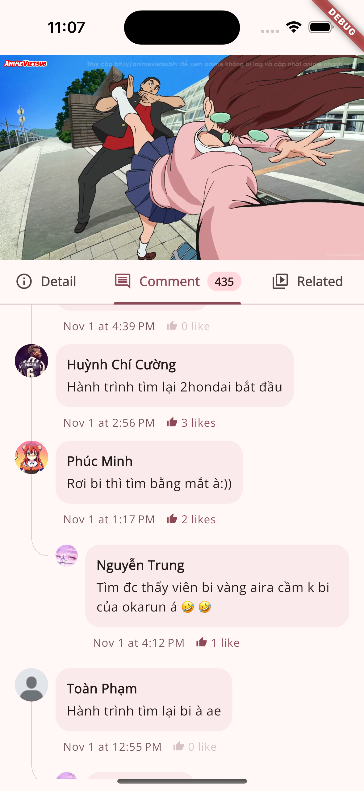
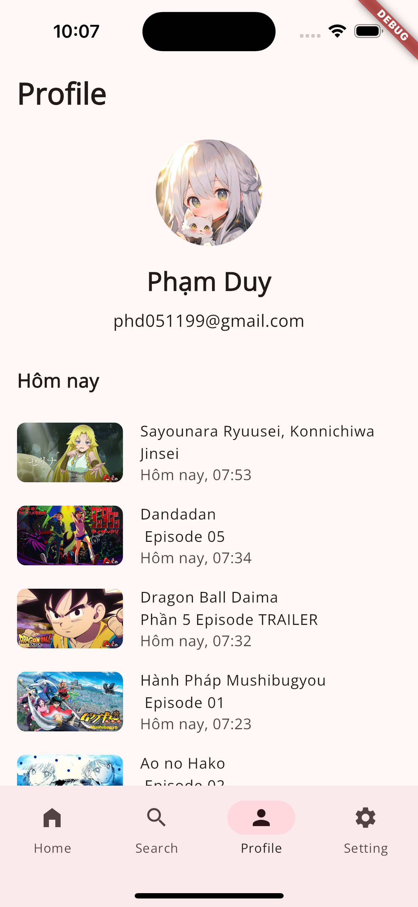
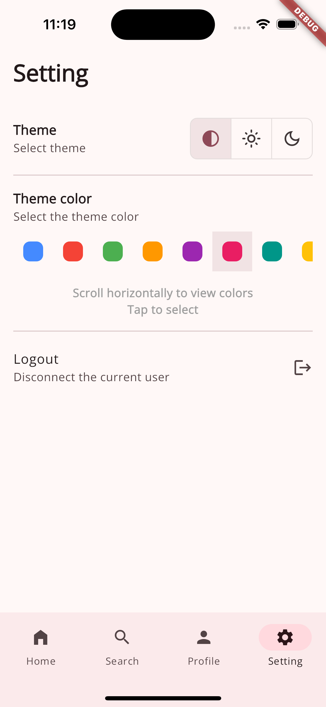

# AniVSub

A modern Flutter application for anime streaming, offering a seamless viewing experience with advanced features.

## Features

- 🎯 Cross-platform support (iOS & Android)
- 🎨 Modern and intuitive UI (MD3)
- 🔍 Advanced search and filtering
- 🎬 High-quality video playback
- ⏭️ Auto-skip intro and outro segments
- 💫 Smooth animations and transitions

## Screenshots

<table>
   <tr>
      <td>
         
      </td>
      <td>
         
      </td>
      <td>
         
      </td>
   </tr>
   <tr>
      <td>
         
      </td>
      <td>
         
      </td>
      <td>
         
      </td>
   </tr>
</table>

## Getting Started

### Prerequisites

- Flutter SDK (>=3.24.4)
- Dart SDK (>=3.5.3)
- Android Studio / Xcode (for mobile development)

### Installation

1. Clone the repository:

   ```bash
   git clone https://github.com/phd051199/anivsub.git
   cd anivsub
   ```

2. Run the initial setup script:

   ```bash
   cd tools
   ./first_boot_init.sh
   ```

3. Create a `.env` file in the root directory with the required environment variables:
   ```env
   HOST_CURL=
   SUPABASE_URL=
   SUPABASE_ANON_KEY=
   ```

### Building

To build the application, use the provided build script:

```bash
cd tools
./build_app.sh
```

## Architecture

This project follows clean architecture principles and uses:

- `bloc` for state management
- `get_it` and `injectable` for dependency injection
- `go_router` for navigation
- `dio` for networking
- `freezed` for data classes
- `retrofit` for API integration

## Contributing

Contributions are welcome! Please feel free to submit a Pull Request.

## License

This project is licensed under the [GNU General Public License v3.0](LICENSE).

## Acknowledgments

- [river_player](https://pub.dev/packages/river_player), [video_player](https://pub.dev/packages/video_player) for video playback
- [flutter_bloc](https://pub.dev/packages/flutter_bloc) for state management
- All other open-source packages that made this project possible
